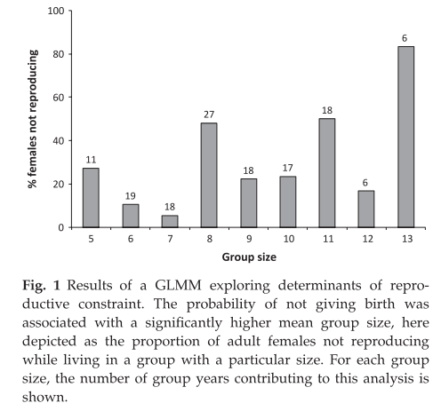

```{r setup, include=FALSE}
knitr::opts_chunk$set(echo = TRUE)
```

# Introduction

**Introduction:** In this paper, Kappeler and Fichtel (2012) examined female reproductive competition in redfronted lemurs (*Eulemur rufifrons*), a female philopatric lemurid species, in an attempt to better understand the interaction between cooperation and competition among kin. 

**Methods:** Forcible eviction, reproductive restraint (or potentially reproductive suppression; prenatal: probability of not giving birth), and reproductive competition (postnatal: infant survival) were all tested as measures of competition. The authors conducted several GLMMs to analyze these types of competition, with fixed factors including several group composition variables (total group size, number of adult females, number of close female relatives, female age, and infant cohort size). Cumulative rainfall was also included as a fixed factor to account for interannual variation in resource availability. 

**Results:** Total group size influenced both eviction rates and reproductive restraint, with females in larger groups having a higher probability of being evicted and of not giving birth. None of the other variables examined influenced eviction or reproductive restraint, and no variables influenced infant survival.  

**Discussion:** These results suggest that when a group exceeds a critical group size (of approximately 10 individuals), female redfronted lemurs reproductively compete with their female relatives by means of eviction and reproductive restraint. 

```{r echo=FALSE, out.width="100%"}

```

# Method Notes

1. Dryad provided a word file with four tables of data for each analysis; this file is included in the repository. Data from the each table was transferred from this file to a CSV file for use in R. Columns were renamed for ease of use in R. 

   + I only used the Reproductive Restraint data, but have uploaded the rest as well.

2. The variables included in the Reproductive Restraint data are:

|Variable Name  |Variable Information                                        | 
|:--------------|:-----------------------------------------------------------|                  
|ID             |Female Identity                                             |
|Group          |Group Identity                                              |
|GaveBirth      |Whether the female gave birth (1 = yes, 0 = no)             |
|AdultFemalesNum|# of adult females in the focal female's group              |   
|Age            |Age of the female (months)                                  |
|Rainfall       |Cumulative rainfall from the corresponding rainy season (ml)|
|GroupSize      |Group size                                                  |


# 1. Descriptive Statistic Replication

I will here be replicating the descriptive statistics regarding the mean age at first reproduction for the female lemurs of this population. In the paper, these can be found on page 690. 

1. Let's start by loading the libraries we'll need. 
```{r}
library(tidyverse)
library(readr)
library(dplyr)
library(compare)
```

2. Now let's load in the data, and show the first six and last six rows. 
```{r}
RestraintData <- read_csv("https://github.com/gbuen0/bueno-gabrielle-ADA-data-reanalysis-assignment/raw/main/Restraint_Table1_K%26F2012.csv", col_names = TRUE)
head(RestraintData)
tail(RestraintData)
```

3. First, I will create a tibble with the age at first birth for each individual female in the population.
```{r}
FemalesThatGaveBirth <- RestraintData[RestraintData$GaveBirth == 1, ] #Subsetting the data to include only females who gave birth
AgesOfFirstBirth <- FemalesThatGaveBirth %>% 
  group_by(ID) %>% #Grouping by ID, to look at each female individually
  summarize(
    AgeAtFirstBirth = min(Age, na.rm = TRUE) #Getting the minimum age at first birth for each female
  )
AgesOfFirstBirth #This is a tibble with the age at first birth for each female. Now I can run descriptive stats to examine ages at first birth for the population.
```

4. Here, I will use the tibble I just created to run the descriptive statistics, and create a new table with them. 
```{r}
DescriptiveDataAgeAtFirstBirth <- AgesOfFirstBirth %>% #Creating a new tibble of descriptive data by taking the tibble I just created and piping it through the summarize function to get the minimum, maximum, mean, and standard deviation of age at first birth, as well as # of subjects.
  summarize(
    MinAgeFirstBirth = min(AgeAtFirstBirth, na.rm = TRUE),
    MaxAgeFirstBirth = max(AgeAtFirstBirth, na.rm = TRUE),
    MeanAgeFirstBirth = mean(AgeAtFirstBirth, na.rm = TRUE),
    SDAgeFirstBirth = sd(AgeAtFirstBirth, na.rm=TRUE),
    NumberOfSubjects = n_distinct(ID, na.rm = TRUE)
  )
DescriptiveDataAgeAtFirstBirth
```

5. Here I've put together a table so that we can visually compare the values of the descriptive stats that I calculated, and those from the paper. Just looking at them, they clearly do not match up, with the exception of MaxAgeFirstBirth.
```{r}
DescriptiveDataAgeAtFirstBirthComparison <- DescriptiveDataAgeAtFirstBirth %>% 
  add_column(Source = c("Bueno Reanalysis"), .before = "MinAgeFirstBirth") #Adding a column to the descriptive tibble to show that the source of these numbers was from my reanalysis. This way, I can compare the descriptive stats I made with the ones from the paper in a table, and it's possible to tell which is from which.

OriginalDescriptiveStats <- tibble( #Making a tibble of the descriptive stats from the original paper for comparison
  Source = "Kappeler & Fichtel 2012",
  MinAgeFirstBirth = 18,
  MaxAgeFirstBirth = 54,
  MeanAgeFirstBirth = 36,
  SDAgeFirstBirth = 12,
  NumberOfSubjects = 12
)
DescriptiveStatsComparison <- rbind(DescriptiveDataAgeAtFirstBirthComparison, OriginalDescriptiveStats) #Combining the two tables (aka the tibbles) to visually compare the values
DescriptiveStatsComparison
```
6. We can also compare them using the compare() function, and again it is clear that only the values in the third column (MaxAgeFirstBirth) are the same. 
```{r}
compare(DescriptiveDataAgeAtFirstBirthComparison, OriginalDescriptiveStats, equal = TRUE)
```

 


# 2. Inferential Statistic Replication

I will here be replicating the GLMM used to calculate reproductive restraint, as seen on page 690, top row of Table 1. As a reminder, reproductive restraint is measured by a female lemur's probability of not giving birth. The results of the GLMM will tell us whether a female was less likely to give birth based on the number of females in her group, her age, her group size, and cumulative amount of rainfall during the corresponding rainy season. 

1. Let's start by loading the libraries we'll need beyond those loaded in part 1. The dataset is already loaded in.
```{r}
library(lme4)
library(lmerTest) #this shows p-values
library(broom.mixed) #this let's me use tidy() on a glmermod
```


2. General Linear Mixed Model. As reported in the methods, the authors used the package `lmer`, and used a logit link function. They also entered all predictor variables simultaneously. They fit the model with variables in the following categories:

   + The binomial response term is whether or not the female gave birth during the corresponding season (1 = yes, 0 = no)
   
   + The fixed factors are: the number of adult females, female age (in months), group size, and cumulative rainfall during the corresponding rainy season (in ml). 
   
   + The random factors are female identity and group identity, with ID nested in group identity.
   
   + **Note:** They said that they nested ID in group identity, but doing that (`(1|ID/Group)`) gave me incorrect results. So I separated them, and voila!

```{r}
glmmReproductiveRestraint <- glmer(GaveBirth ~ AdultFemalesNum + Age + GroupSize + Rainfall + (1|ID) + (1|Group) , data = RestraintData, family = binomial(link = "logit")) #Running the GLMM
summary(glmmReproductiveRestraint)
```


3. Another way to visualize the coefficient information, in a *tidier* fashion!
```{r}
ReprodRestraintTidy <- tidy(glmmReproductiveRestraint)
ReprodRestraintTidy
```

4. Let's clean that up to make for an easier visual comparison with the data presented in the paper
```{r}
r <- ReprodRestraintTidy[ReprodRestraintTidy$effect == "fixed", ] #Removing the random factors, because statistics for those are not in the paper. I am also using a dummy object (r), and will do the same for the other objects in here. That way I can easily run and rerun code.
r1 <- subset(r, select = -c(group, statistic)) #dropping the "group" and "statistic" columns, because those are not in the paper and aren't relevant for the comparisons
ReprodRestraintTidier <- r1 %>% 
  add_column(Source = c("Bueno Reanalysis"), .before = "effect") #Adding a column to show that the source of the data is from my reanalysis
names(ReprodRestraintTidier)[names(ReprodRestraintTidier) == "term"] <- "factor" #renaming the column "term" to "factor"
ReprodRestraintTidier
```

5. Let's make a tibble from the data presented in Table 1 of the publication, to more easily compare my reanalysis with theirs. 
```{r}
OriginalInferentialStats <- tibble( #creating a tibble, and adding in the data by hand
  Source = c("Kappeler & Fichtel 2012", "Kappeler & Fichtel 2012", "Kappeler & Fichtel 2012", "Kappeler & Fichtel 2012", "Kappeler & Fichtel 2012"),
  effect = c("fixed", "fixed", "fixed", "fixed", "fixed"), 
  factor = c("(Intercept)", "AdultFemalesNum", "Age", "GroupSize", "Rainfall"),
  estimate = c(4.59, -0.42, 0.003, -0.25, -0.001),
  std.error = c(1.26, 0.37, 0.005, 0.1, 0.0007),
  p.value = c("<0.001", 0.26, 0.52, 0.01, 0.13)
)
OriginalInferentialStats
```

6. Let's now combine these two tibbles. Look how beautiful and matched they are! The only difference is the standard error and p-value of group size, which in my replication is not significant, even though it is significant in the paper. 
```{r}
c <- rbind(ReprodRestraintTidier, OriginalInferentialStats) #merging the two tibbles in a dummy object
compareInferentialStats <- arrange(c, factor) #arranging them by factor, so we can compare each row side by side
compareInferentialStats
```


# 3. Visualization

I will here be replicating Figure 1 (page 691), which displays the results of the GLMM looking at reproductive restraint.

1. Let's load in libraries we need that haven't been loaded yet. We already have the dataset loaded in from above. 
```{r}
library(ggplot2)
library(dplyr)
```

2a. Let's get the data ready for a plot! I'm separating this into two chunks so we can see the outputs as I go along. 
```{r}
Fig1Count <- RestraintData %>% count(GroupSize, GaveBirth) #this gives a table with GroupSize, whether or not a female gave birth, and a count of how many females gave birth for each group size. 
Fig1Sums <- aggregate(n~GroupSize, Fig1Count, sum) #This is a table with each group size, and the number of adult females in each category (category being group size). 
Fig1Combine <- merge(Fig1Count, Fig1Sums, by="GroupSize") #this merges the first two tables into one (they're merged by the variable "GroupSize"), to give a nice table that has the variables Group Size, whether or not a female gave birth, count, and sum
names(Fig1Combine)[names(Fig1Combine) == "n.x"] <- "CountBirth" #r autonamed the count and sum columns, so I'm renaming them here. 
names(Fig1Combine)[names(Fig1Combine) == "n.y"] <- "SumBirth"
Fig1Combine
```
2b. Continuing on!
```{r}
d <- transform(Fig1Combine, ProportionGaveBirth = CountBirth/SumBirth) #Here I'm adding a column to Fig1Combine that has the proportion of females that gave birth per group size. I'm putting it in a dummy object for ease of use. 
f <- d[d$GaveBirth == 0, ] #I'm only graphing the females who didn't give birth, so here I'm subsetting out the females who did give birth. 
f1 <- cbind(f, replicate(1, f$ProportionGaveBirth)) #I'm now replicating the "ProportionGaveBirth" column
names(f1)[names(f1) == "replicate(1, f$ProportionGaveBirth)"] <- "PercentGaveBirth" #I'm now renaming the replicated column "PercentGaveBirth".
e <- transform(f1, PercentGaveBirth = PercentGaveBirth*100) #I'm multiplying "PercentGaveBirth" by 100, to give a whole number percentage instead of a fraction, to better match the figure in the paper.
e
```

3. We're ready to plot! All aesthetics are meant to copy those seen in Figure 1. 
```{r}
p <- ggplot(data = e, aes(x = GroupSize, y = PercentGaveBirth)) + 
  geom_bar(stat = 'identity', fill = "gray", colour = "black") +
  geom_text(aes(label = SumBirth), position = position_dodge(width=0.9), vjust = -0.25) + #adds the sum on top of each bar
  scale_x_continuous(breaks = 5:13) + #Editing the x axis ticks to make them represent each bar
  xlab("Group Size") + #Changing x axis title
  ylab("% females not reproducing") #Changing y axis title
p
```

4. Let's compare that with Figure 1 from the paper. 
```{r echo=FALSE, out.width="70%"}

```


# Discussion

## 1. Descriptive Statistics

I was not very successful at replicating the numbers for age at first birth reported in this publication. I believe this is because the dryad dataset was different from the one they actually calculated these numbers from. More specifically:

* The authors reported that the youngest female to give birth was 18 months. That was either a mistake, or the female was not included in the dataset given, because I double-checked and looked straight at the data, and the youngest age at which a female gave birth was 30 months. 

* They also reported that N = 12. The dryad data has 20 individual females that gave birth. My guess is that they started collecting data after 8 of those females became reproductively mature, and so they weren't able to say when those 8 females first gave birth. However that information was not in the supplied data, so I'm working with what I was given. 


## 2. Inferential Statistics

I got very similar results! As noted in part 2, the authors said they had used ID nested in group identity as a random factor. When I did that (by writing the random factors as `(1|ID/Group)`), I got incorrect results. Un-nesting them got me the right ones! :) Very exciting after so much time spent trying to figure this out. 

* The only difference is the standard error and p-value for group size: Both were larger in my replication, and so weren't significant, even though they were significant in the publication. I tried different methods of nesting (using colons instead of slashes, switching the order, etc.), and while using nesting as shown above did give me a significant value for group size, it gave me all different values for the other statistics. So, I'm sticking with what I did. 

   + I'm guessing there's some slight difference between the dryad file and what they used. 

* Note on scaling: I realized that the authors had used commas instead of periods as decimals in the dryad data, and that's why the rainfall variable had such huge values (it was reading 998.47ml as 99,847ml!). I changed the commas to periods in the excel file, and no longer had an issue with scaling, and got the right answers! 

## 3. Visualization

I think I did a pretty good job at replicating this visualization :) 

I probably brute-forced it more than the authors did, but I got the same results and that's what I'm focusing on!


# References

Kappeler, P. M., & Fichtel, C. (2012). Female reproductive competition in Eulemur rufifrons: eviction and reproductive restraint in a plurally breeding Malagasy primate. Molecular Ecology, 21(3), 685-698.

Kappeler, Peter M.; Fichtel, Claudia (2012), Data from: Female reproductive competition in Eulemur rufifrons: eviction and reproductive restraint in a plurally breeding Malagasy primate, Dryad, Dataset, https://doi.org/10.5061/dryad.5t689